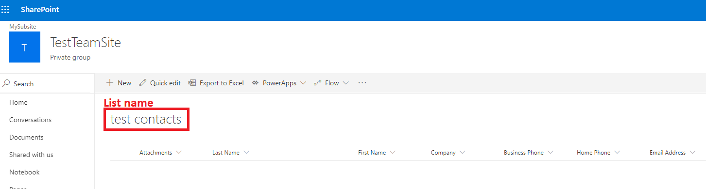

# Microsoft SharePoint Lists extractor

Download SharePoint lists directly to Keboola Storage.

**Table of contents:**  
  
[TOC]

# Functionality Note

## PersonOrGroup columns

Person or Group columns contain a user ID values. To retrieve additional information it is necessary 
to download the **Users** list, which is default for each site.

To retrieve a Users list:

- Navigate to https://`{my-tenant}`.sharepoint.com/`{site-relative-url-path}`/_catalogs/users/detail.aspx
- Copy the name of the list - in English localisation it is `User Information List`
- Set this list in list definition configuration


# Configuration
 
## Host base name

Your MS SharePoint host, typically something like `{my-tenant}.sharepoint.com`

## List definition

### Site relative URL path

Relative path of the SharePoint site where the list is present. You can find this when you navigate to your site in the browser. 
After navigating to the site the URL will look something like this: `my-tenant.sharepoint.com/sites/MySite`. The site url path is `/sites/MySite`. 
If you leave this field empty, or leave the default value `/sites/root`, the root site will be selected.

### List name

Name of the SharePoint list you wish to download, exactly as it is displayed in the UI (case sensitive). 



### Include additional system columns

SharePoint lists also contain system columns that are not visible in the default UI view. By selecting this option it is possible to retrieve these 
columns also. **NOTE** By default, the extractor uses the `Display Name` of columns. It may happen that some of the system or custom columns, 
share the same display name. In such case, the extractor automatically deduplicates the column names by appending the underlying unique `API name` 
of the column separated by the `_` underscore sign. Leading to column names such as `Title_LinkTitleNoMenu`, `Title_LinkTitle`.

### Use column display names

List columns in SharePoint consists of a `display name` that is by default displayed in the SharePoint UI view 
and an `api name` that is underlying unique identifier of a column and does not change. This option 
allows you to choose which of the names you wish to use in the result table. 

**NOTE** that when using the `display name` duplicate column names will be automatically deduplicated. 
Also some of the system columns are prefixed with `_`, these underscores will be dropped since the *Storage* columns cannot
 start with underscore signs.

## Storage load setup

Parameters of the resulting table.

- **Load type** - If set to Incremental update, the result tables will be updated based on primary key. Full load overwrites the destination table each time.
- **Result table name** - Name of the resulting storage table, where the selected list data will be stored. e.g. `my_table`. 
The resulting table will have `_data` appended to its name, e.g. `my_table_data`.


# Result

The result of the extraction is multiple tables:

Table `lists_metadata` containing metadata regarding all lists downloaded within the configuration. Containing columns such as 
`id`, `site_id`, `lastModifiedBy`, `createdBy`, etc.

Each list data selected for download is stored in separate table based on the configuration, e.g. `my_table_data`. 

Use `lists_metadata.id` and `my_table_data.list_id` to link each list with its metadata.
 
# Development
 
This example contains runnable container with simple unittest. For local testing it is useful to include `data` folder in the root
and use docker-compose commands to run the container or execute tests. 

If required, change local data folder (the `CUSTOM_FOLDER` placeholder) path to your custom path:
```yaml
    volumes:
      - ./:/code
      - ./CUSTOM_FOLDER:/data
```

Clone this repository, init the workspace and run the component with following command:

```
git clone https://bitbucket.org:kds_consulting_team/kds-team.ex-ms-sharepoint.git my-new-component
cd my-new-component
docker-compose build
docker-compose run --rm dev
```

Run the test suite and lint check using this command:

```
docker-compose run --rm test
```

# Integration

For information about deployment and integration with KBC, please refer to the [deployment section of developers documentation](https://developers.keboola.com/extend/component/deployment/) 